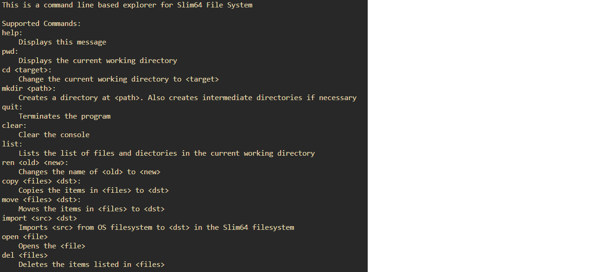
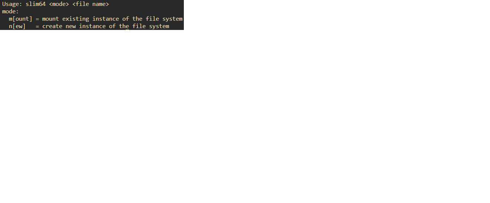
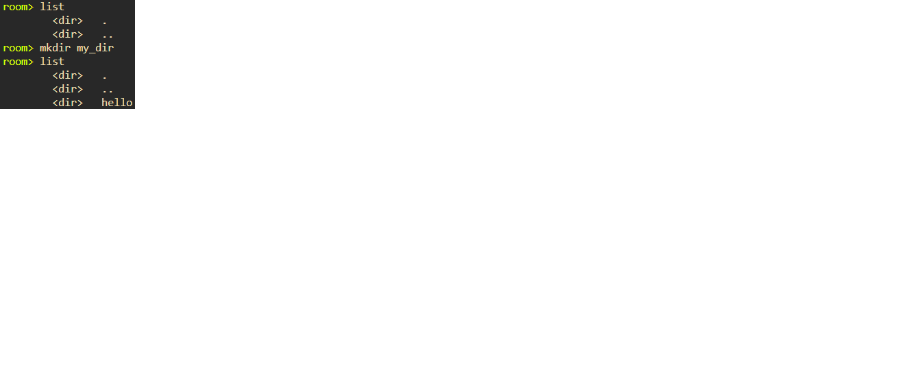
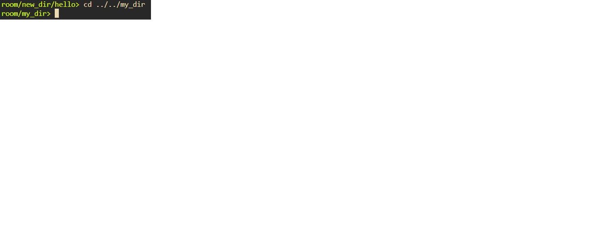
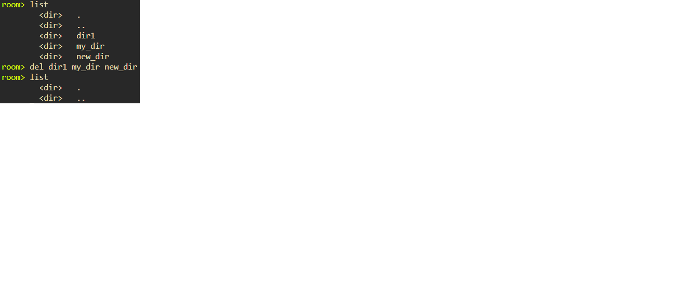
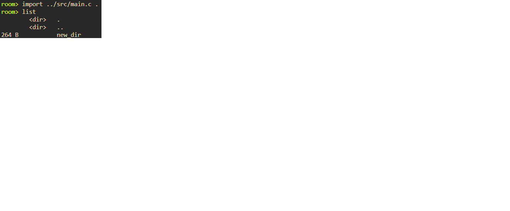

## Slim64
### An emulated file system without using C standard library
This was created as a DSA project.
It comes with a console-based explorer.
The list of commands supported by the explorer are:

*Commands*

Below are some snapshots of the program

*Usage*

*Creating Directories*

*Changing Directories*

*Deleting*

*Import*
